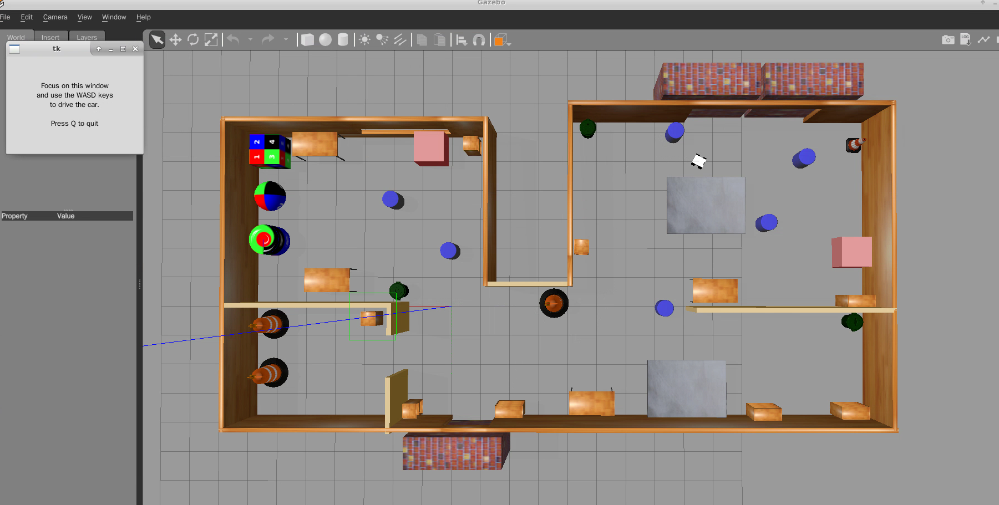
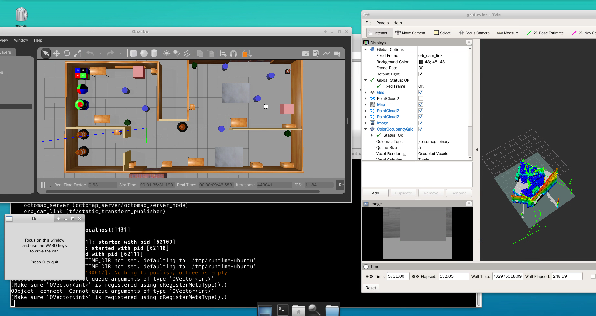
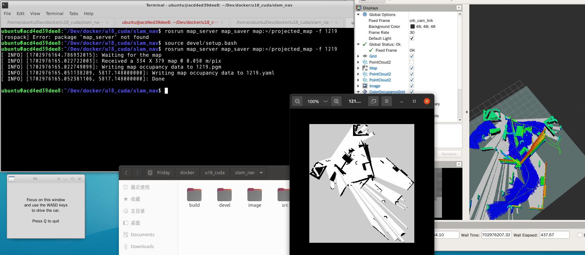

<!--
 * @Author: https://github.com/haohaoalt
 * @Date: 2023-12-19 16:20:56
 * @LastEditors: hayden haohaoalt@163.com
 * @LastEditTime: 2023-12-19 17:01:45
 * @FilePath: /slam_nav/README.md
 * @Description: 
 * Copyright (c) 2023 by haohaoalt@163.com, All Rights Reserved. 
-->
# slam_nav
from akm_nav

## 01 Build and Install
```
sudo apt-get install libsdl-image1.2-dev
sudo apt-get install ros-melodic-move-base-msgs
sudo apt-get install ros-melodic-tf2-sensor-msgs
sudo apt update && sudo apt install ros-melodic-dwa-local-planner
sudo apt-get install ros-melodic-sbpl
sudo apt-get install ros-melodic-driver-base
sudo apt-get install ros-melodic-gazebo-ros-control
sudo apt-get install ros-melodic-effort-controllers
sudo apt-get install ros-melodic-joint-state-controller
sudo apt-get install ros-melodic-ackermann-msgs
sudo apt-get install ros-melodic-global-planner
sudo apt-get install ros-melodic-teb-local-planner

```
- models复制到指定目录;
- 编译代码目录中thirdparty，先删除build ./build.sh
- catkin_make


## 02 运行

## mapping

稀疏地图与栅格地图的建立，建图包括小车定位所需要的稀疏地图（osa）和导航所需要的栅格地图

Step 1启动仿真环境
```
cd ~/slam_nav
source devel/setup.bash
roslaunch akm_simu ackermann.launch
```


Step 2 新开一个终端 运行ORB_SLAM3 模式选true false-------第一个true代表稠密重建 第二个false代表不进行纯定位
```
#其中akm_slam.yaml中一定确保System.SaveAtlasToFile: "house" 否则不会保存地图
cd ~/slam_nav
source devel/setup.bash
cd src/thirdparty/ORB_SLAM3_relocation_nav
rosrun akm_location Akm_RGBD Vocabulary/ORBvoc.bin Examples/RGB-D/akm_slam.yaml true false
```


//Step 3新开一个终端 进行栅格地图的建立
cd ~/slam_nav
source devel/setup.bash
roslaunch akm_pnc grid.launch



//Step 4 打开键盘控制小车
注：用另一个tk控制也行
cd ~/slam_nav
source devel/setup.bash
rosrun akm_simu teleop_key
 
//Step 5 建图过程可以慢一些 不要做纯旋转和快速转动对建图很不好 平稳建完即可

## Saving

#step 1 按照上面的所提akm_slam.yaml 中写入System.SaveAtlasToFile: "house"  house.osa文件
提示：自己建立一个保存地图的文件夹，每次保存后备份一下地图，否则有可能误操作打开程序再关闭保存一张空地图

#step2 等待rviz中栅格地图建立完毕 使用如下命令保存
rosrun map_server map_saver map:=/projected_map -f 1219



最后一个参数为保存地图的名称，指令成功后会在终端所在目录下生成 1219.pgm 和 1219.yaml ，需要把office.yaml中的-nan值改为0.000
#step3 把 1219.pgm 和 1219.yaml 一起复制到 /home/slam/akm_nav/src/slam/map 下 或者输入下面指令
cp 1219.pgm /home/slam_nav/src/slam/map
cp 1219.yaml /home/slam/slam_nav/src/slam/map
  
#step4 修改/home/slam/akm_nav/src/pnc/launch 文件夹下mbf_ackermann.launch ，

<arg name="map" default="$(find akm_slam)/map/office.yaml"/>修改为    
<arg name="map" default="$(find akm_slam)/map/1219.yaml"/>

以上工作完成后导航所需要的地图就有了，恭喜完成第一阶段！


## Planning and Navigation

#重点：可以ctrl+c掉上面的所有程序，包括gazebo

#step 1启动仿真环境
cd /home/slam/akm_nav
source devel/setup.bash
roslaunch akm_simu ackermann.launch
 
#step 2新开一个终端 运行ORB_SLAM3 false true-------第一个false代表不进行稠密重建 第二个true代表进行纯定位
#其中akm_pure_location.yaml中一定确保System.LoadAtlasFromFile: "house" 否则不会加载地图
cd /home/slam/akm_nav
source devel/setup.bash
cd /home/slam/akm_nav/src/thirdparty/ORB_SLAM3_relocation_nav
rosrun akm_location Akm_RGBD Vocabulary/ORBvoc.bin Examples/RGB-D/akm_pure_location.yaml false false


#step 3新开一个终端 启动move_base节点
cd /home/slam/akm_nav
source devel/setup.bash
roslaunch akm_pnc mbf_ackermann.launch
  
  #step4 在rviz中选择要导航目标点